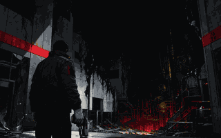

# Red Ledger

A complete retro first-person action campaign set inside a surreal insurance operation. The browser game contains three episodes, 27 maps, eight weapons, twelve standard enemies, four bosses, authored mechanisms, secrets, deterministic demos, save slots, touch controls, and five difficulty levels.



**Play:** https://willtran87.github.io/red-ledger/

## Run Locally

```powershell
cd game
npm ci
npm run dev
```

Open the local URL printed by Vite. Keyboard, mouse, controller, and touch input are supported. Controls can be remapped from Options.

## Verify

```powershell
cd game
npm run test:release
```

The release gate is self-contained: it builds the standalone package, starts an isolated local server, runs unit, campaign, gameplay, progression, responsive/mobile, combat/save, deterministic demo, controls, mechanisms, generated particle feedback, active-combat lifecycle/performance, production portability, and required Chromium/Firefox/WebKit tests, then stops the server.

## Documentation

- [Game design document](GAME_DESIGN_DOCUMENT.md)
- [Art production bible](ART_PRODUCTION_BIBLE.md)
- [Asset manifest](ASSET_MANIFEST.md)
- [Image-generation pipeline](IMAGEGEN_PIPELINE.md)
- [Completion audit](implementation/GAME_COMPLETION_AUDIT.md)
- [Release playtest protocol](implementation/RELEASE_PLAYTEST_PROTOCOL.md)

The public repository includes the complete runtime art library and reproducible game source. Raw generation intermediates and third-party reference boards are intentionally excluded.
GitHub Pages uses the repository's `main:/docs` source so publishing works with ordinary repository credentials and does not require workflow scope. Run `npm run pages:publish` from `game/` to build, replace `docs/` with that exact output, and verify every published file by SHA-256 before committing. `npm run pages:verify` is the explicit staleness gate.
